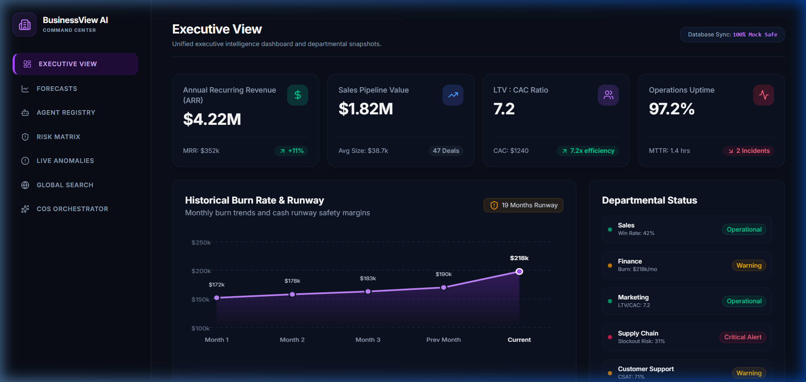
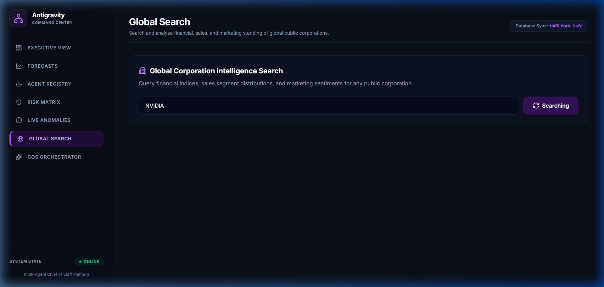

# BusinessView AI Command Center 🏢🤖

A modern, high-performance executive dashboard powered by a Multi-Agent Chief of Staff Orchestrator. It integrates real-time business operations data (Salesforce opportunities and Razorpay recurring billing) into a single, unified view, enabling CEOs and executives to ask natural language questions about company health and get instant, data-driven synthesis.

---

## ⚡ Visual Demonstrations

### 🖥️ Executive View & Brand Dashboard


### 🔍 Global Company Search Interface


---

## 🏗️ System Architecture & Workflow

The platform operates on a **Zero-Cost Caching Architecture** with background synchronizers to control API and LLM token costs.

```mermaid
flowchart TD
    subgraph Third-Party integrations [Live API Sources]
        R[Razorpay API]
        S[Salesforce API]
    end

    subgraph Data & Sync [Sync & Storage Layer]
        SW[Background Scheduler] -->|Every 4 hours| R
        SW -->|Every 4 hours| S
        R -->|Active Subscriptions| DB[(Supabase Cache / Local Fallback)]
        S -->|Open Opportunities| DB
    end

    subgraph Orchestrator [LangGraph AI Router]
        U[User Query] -->|Inbound Question| COS[Chief of Staff Agent]
        COS -->|Consults| F[Finance Agent]
        COS -->|Consults| SA[Sales Agent]
        COS -->|Consults| MI[Market Intelligence Agent]
        
        F -->|Queries cached metrics| DB
        SA -->|Queries cached deals| DB
        
        F -->|Report Section| SYN[Synthesizer Agent]
        SA -->|Report Section| SYN
        MI -->|Report Section| SYN
        
        SYN -->|Executive Briefing| UI[React Frontend Dashboard]
    end
    
    style Orchestrator fill:#1e1e38,stroke:#4a4a8a,stroke-width:2px;
    style Data & Sync fill:#152c1e,stroke:#2a5c3a,stroke-width:2px;
```

### Key Workflows:
1. **Background Syncing**: The `BackgroundScheduler` runs [salesforce_sync.py](backend/integrations/salesforce_sync.py) and [razorpay_sync.py](backend/integrations/razorpay_sync.py) every 4 hours. These connect to Salesforce SOAP/REST endpoints and Razorpay Subscriptions to fetch fresh operational metrics.
2. **LLM Cost Control**: Syncs are cached in Supabase rather than querying Salesforce/Razorpay live on every user prompt. This keeps expensive API calls at zero.
3. **Specialist Consultations**: The LangGraph engine routes executive queries to specialized AI agents (Finance, Sales, Marketing, Supply Chain, Support, Operations), each pulling relevant data from the database cache.
4. **Synthesizer Compilation**: The final Synthesizer compiles individual agent reports into an executive brief.

---

## 🛡️ Security Implementations

This project implements strict production-ready security practices:
* **API Key Header Verification**: All backend endpoints are protected with an `X-API-Key` verification header.
* **Input Sanitization**: User inputs on company searches are sanitized via regex patterns to eliminate prompt injection attempts.
* **CORS Whitelisting**: CORS middleware restricts backend connections specifically to verified frontend origins rather than wildcard origins.
* **Safe Environments**: Secret keys are kept isolated in local `.env` configuration files and blocked from version control tracking via `.gitignore`.

---

## 🚀 Getting Started

### 1. Prerequisites
Ensure you have Python 3.10+ and Node.js 18+ installed.

### 2. Backend Setup
1. Navigate to the backend folder:
   ```bash
   cd backend
   ```
2. Install dependencies:
   ```bash
   pip install -r requirements.txt
   ```
3. Create a `.env` file based on `.env.example` and add your keys:
   ```env
   GITHUB_MODELS_API_KEY=your_key
   GROQ_API_KEY=your_key
   RAZORPAY_KEY_ID=rzp_test_...
   RAZORPAY_KEY_SECRET=...
   SF_USERNAME=...
   SF_PASSWORD=...
   SF_SECURITY_TOKEN=...
   APP_API_KEY=command_center_secret_key
   ALLOWED_ORIGINS=http://localhost:5173
   DEV_MODE=true
   ```
4. Start the FastAPI server:
   ```bash
   python main.py
   ```

### 3. Frontend Setup
1. Navigate to the frontend folder:
   ```bash
   cd ../frontend
   ```
2. Install Node packages:
   ```bash
   npm install
   ```
3. Start the Vite development server:
   ```bash
   npm run dev
   ```
4. Open [http://localhost:5173](http://localhost:5173) in your browser.
